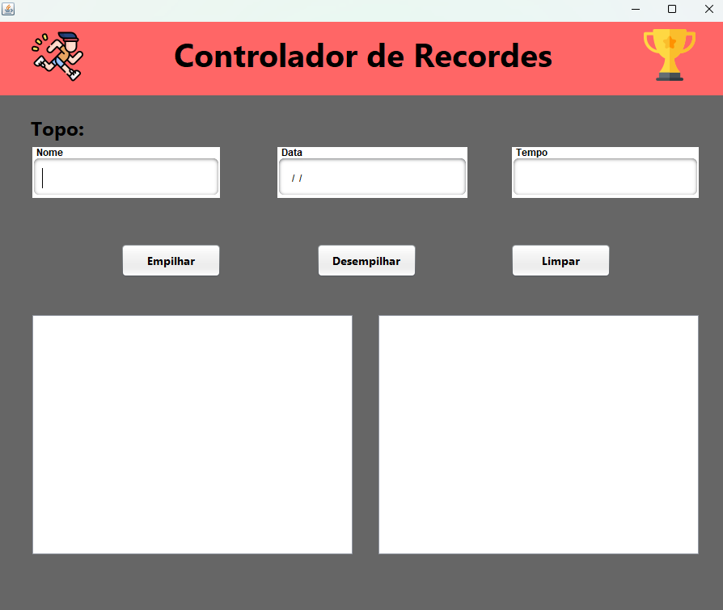

# <h1 align="center">App Controlador de Recordes</h1>

### Tecnologias Utilizadas:
* Java
* Java Swing

### Ferramentas Utilizadas:
* Apache NetBeans

### Funções do Software:
* Verificação do tempo do novo recorde antes de adicionar à pilha
principal;
* Movimentação de um recorde da pilha principal para a pilha auxiliar;
* Visualização das pilhas em tempo real nas áreas de listagem;

  ### Tela principal:

<figure>
  
</figure>
